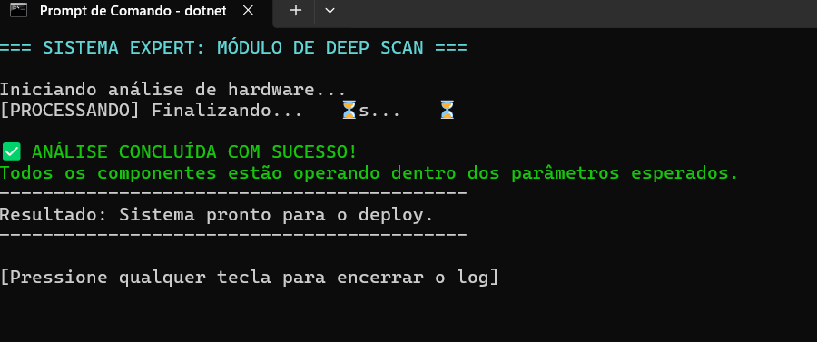

# una-ihcux-lista03
# Operação Deep Scan (Heurísticas de UX no Terminal)
Nesse projeto foi usado 1ª Heurística de Nielsen (Visibilidade do Status do Sistema), que basicamente é sempre manter o usuario informado do que esta acontecendo.
# Comandos usados
`cd`: Comando para navegar entre pasta.

`dotnet new console`: Comando para criar um projeto que roda em um console.

`dotnet run`: Comando para iniciar o projeto.

`dotnet build`: O comando compila o código-fonte de um projeto .NET e suas dependências em binários (.dll), verificando erros de sintaxe e estrutura.
# Foto do cmd

## 📸 Evidência de Execução

